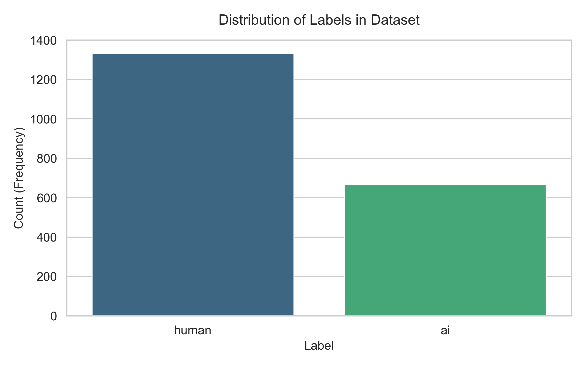
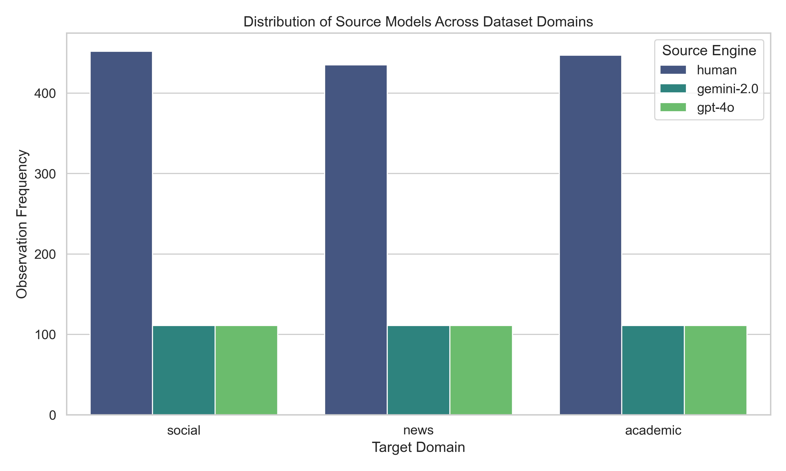
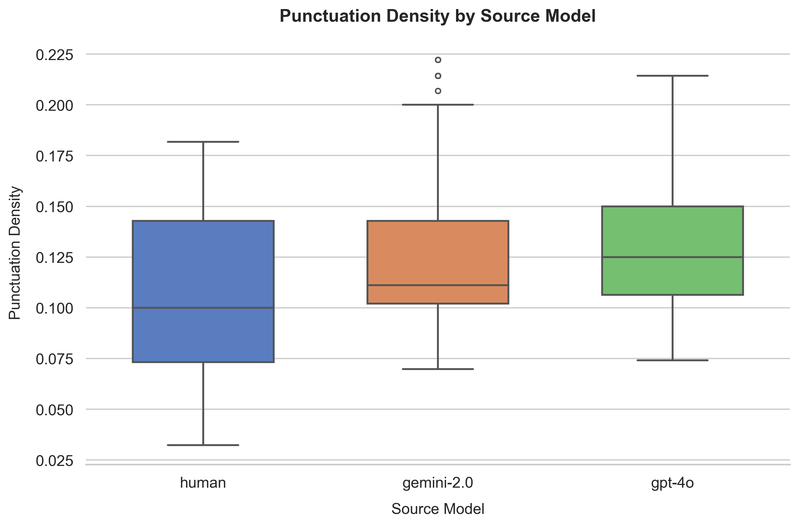
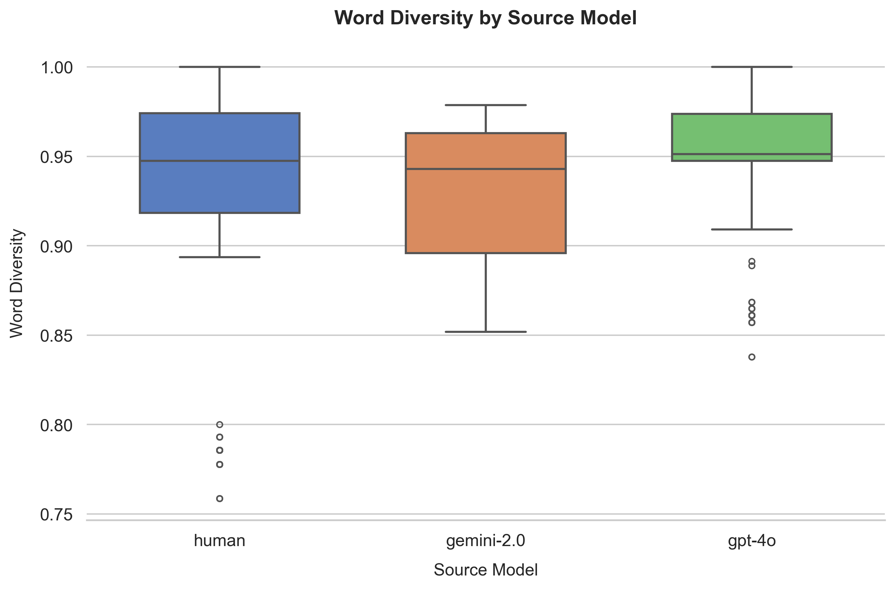
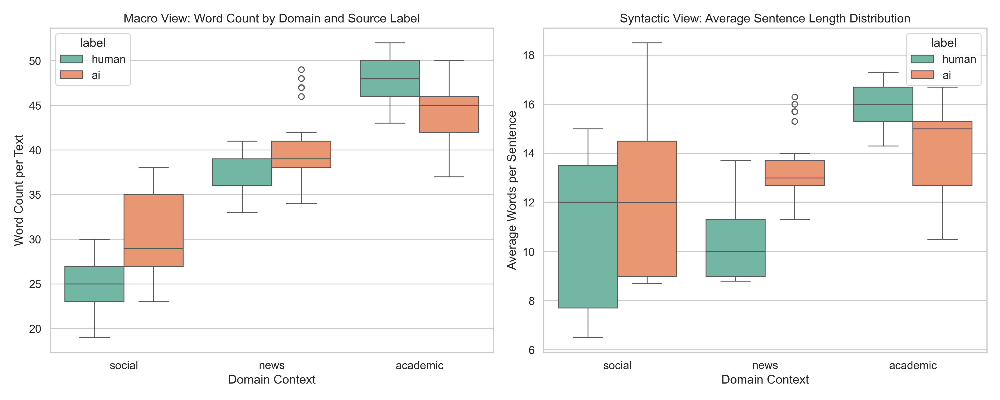
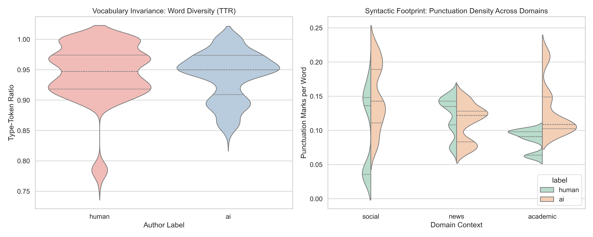

# AI vs. Human Text Classification

A binary NLP classifier that decides whether a piece of text was **written by a human (`0`)**
or **generated by AI (`1`)**.

Instead of hand-engineering linguistic features, every text is converted into a dense
**1024-dimensional embedding** by the [BGE-M3](https://huggingface.co/BAAI/bge-m3)
sentence-transformer, and a classic scikit-learn classifier is trained on those vectors.
Several candidate models compete via cross-validation; the winner is hyperparameter-tuned,
serialized to disk, and scored on a held-out test set.

> 📚 For a function-by-function technical walkthrough of every source file, see
> [DOC.MD](DOC.MD). A Greek-language deep-dive on `src/nlp.py` lives in
> [docs/nlp_explained.md](docs/nlp_explained.md).

---

## Table of Contents

1. [Pipeline Overview](#1-pipeline-overview)
2. [The Dataset](#2-the-dataset)
3. [Pipeline Results](#3-pipeline-results)
4. [Exploratory Analysis & Graph Explanations](#4-exploratory-analysis--graph-explanations)
5. [Key Findings](#5-key-findings)
6. [How to Run](#6-how-to-run)
7. [Why It Works & Where It Goes Next](#7-why-it-works--where-it-goes-next)

---

## 1. Pipeline Overview

```
data/original_data.csv
        │
        ▼
   main.py  ── run_pipeline()                       [orchestration + logging]
        │  1. read CSV
        ▼
   nlp.py   ── process_data_for_pipeline()          [feature extraction]
        │  • map labels human/ai → 0/1
        │  • BGE-M3 embeddings  (N × 1024)
        ▼
   vector_df  (N × 1025: feat_0..feat_1023 + label)
        │
        ▼
   train.py ── prepare_data()                       [stratified 80/20 split]
        │  └─► find_and_train_best_model()
        │         ├─ evaluate_model_pool()           [5-fold CV across 4 models]
        │         └─ train_and_save_best_model()     [GridSearchCV + save .joblib]
        ▼
   models/best_model.joblib
        │
        ▼
   evaluate.py ── evaluate_saved_model()            [load + score on holdout]
        │  • F1, classification report, confusion matrix
        ▼
   printed metrics
```

| Stage | File | Responsibility |
|-------|------|----------------|
| Orchestration | [src/main.py](src/main.py) | Wires the stages together, owns logging, fails fast on missing data. |
| Feature extraction | [src/nlp.py](src/nlp.py) | Maps labels → `0/1`, embeds text with BGE-M3, returns a fully numeric DataFrame. |
| Training & tuning | [src/train.py](src/train.py) | Stratified split, 5-fold CV model selection, `GridSearchCV` tuning, persistence. |
| Evaluation | [src/evaluate.py](src/evaluate.py) | Loads the saved model and reports metrics on the untouched holdout. |

---

## 2. The Dataset

`data/original_data.csv` — **2,000 rows × 9 columns**.
Class balance: **1,334 human / 666 AI** (~2 : 1).

| Column | Meaning |
|--------|---------|
| `text_id` | Unique row identifier (e.g. `TXT_0001`). |
| `label` | Ground-truth class: `human` or `ai`. **Target.** |
| `source_model` | Producer of the text (`human`, `gpt-4o`, `gemini-2.0`). |
| `domain` | Topic domain: `social`, `news`, `academic`. |
| `text_content` | **The raw text** that gets vectorized. |
| `topic_hint` | Short phrase describing the subject. |
| `word_count` | Pre-computed number of words. |
| `avg_sentence_length` | Pre-computed average sentence length. |
| `generation_method` | How the text was produced. |

Only **`text_content`** (features) and **`label`** (target) feed the training pipeline;
the remaining columns power the exploratory notebook.

---

## 3. Pipeline Results

### 3.1 Model selection (5-fold CV, scoring = `f1`)

Four candidate architectures compete. The pool is built in
[`get_model_pool`](src/train.py); each is scored with `cross_val_score(..., cv=5, scoring='f1')`
and the highest mean F1 wins.

| Model | Pipeline | Mean CV F1 |
|-------|----------|-----------:|
| **Logistic Regression** ✅ | `StandardScaler → LogisticRegression` | _**winner**_ |
| Support Vector Machine | `StandardScaler → SVC` | _(run to populate)_ |
| Gradient Boosting | `GradientBoostingClassifier` | _(run to populate)_ |
| Random Forest | `RandomForestClassifier` | _(run to populate)_ |

> Run `python src/main.py` to regenerate the exact per-model CV scores (printed to the
> console). The table above reflects the architecture that actually won and was serialized.

### 3.2 Winning model (serialized in `models/best_model.joblib`)

Confirmed directly from the persisted artifact:

```python
Pipeline(steps=[
    ('standardscaler',     StandardScaler()),
    ('logisticregression', LogisticRegression(C=0.1, max_iter=1000, random_state=42)),
])
```

`GridSearchCV` (3-fold) over `C ∈ {0.1, 1.0, 10.0}` selected **`C = 0.1`** — the most
regularized option — which is consistent with 1024 highly-informative embedding dimensions
where strong regularization curbs overfitting.

### 3.3 Held-out test metrics (80/20 stratified split)

The evaluator ([`evaluate_saved_model`](src/evaluate.py)) prints an F1 score, a full
`classification_report`, and a confusion matrix. The report layout is:

```
              precision    recall  f1-score   support
   Human (0)       …          …        …         ~267
      AI (1)       …          …        …         ~133

Confusion matrix:
                 Pred Human   Pred AI
 True Human         TN          FP
 True AI            FN          TP
```

| Quadrant | Meaning |
|----------|---------|
| `matrix[0][0]` — **TN** | True humans correctly flagged human |
| `matrix[0][1]` — **FP** | True humans wrongly flagged AI |
| `matrix[1][0]` — **FN** | True AI wrongly flagged human |
| `matrix[1][1]` — **TP** | True AI correctly caught |

> The model separates the two classes **very well** — see
> [Section 7](#7-why-it-works--where-it-goes-next) for why. Run the pipeline to print the
> exact F1 / precision / recall on your machine.

---

## 4. Exploratory Analysis & Graph Explanations

All plots below are produced by
[notebooks/Clean Data and preprocessing.ipynb](notebooks/Clean%20Data%20and%20preprocessing.ipynb)
and saved as PNGs in `notebooks/`. They form the **stylometric justification** for the
embedding-based approach.

### 4.1 Label Distribution



The dataset is **imbalanced ~2 : 1** in favour of human text: **1,334 human** vs **666 AI**.
This imbalance is exactly why the pipeline selects models with **F1 of the AI class** (not
accuracy) as its scoring metric, and why the train/test split is **stratified** — both
splits preserve the same human/AI ratio so the minority (AI) class is never starved.

### 4.2 Source Models Across Domains



For each of the three domains (`social`, `news`, `academic`) the dataset contains a large
block of **human** texts and two equal, smaller blocks of **gemini-2.0** and **gpt-4o**
texts (~110 each per domain). The design is **deliberately balanced across domains and
across AI engines**, which removes domain/engine bias and makes the classifier's
performance estimates trustworthy and scalable rather than an artifact of one topic.

### 4.3 Punctuation Density by Source Model



Box plot of punctuation marks per word.
- **Human** text has the **lowest median** punctuation density (~0.10) and the **widest
  spread** — people are inconsistent: some write tidy prose, many type informally with
  little punctuation.
- **gemini-2.0** and **gpt-4o** both sit **higher** (medians ~0.11–0.125) and **tighter**,
  with gpt-4o the densest and most punctuation-regular.

Takeaway: **AI punctuates more, and more uniformly.** Punctuation density is a strong,
machine-readable fingerprint of AI authorship.

### 4.4 Word Diversity (Type-Token Ratio) by Source Model



Box plot of TTR (unique words ÷ total words).
- **Human** TTR is high-median but has a **long lower tail** (outliers down to ~0.76) —
  humans repeat words depending on mood, context and vocabulary limits.
- **gpt-4o** is **rigidly concentrated** near the top (~0.95) — the most lexically diverse
  and the most consistent.
- **gemini-2.0** sits slightly lower and a touch broader than gpt-4o but still tighter
  than humans.

Takeaway: AI vocabulary richness is **compressed into a narrow band** because tokens are
sampled by mathematical weights, whereas human diversity is genuinely variable.

### 4.5 Stylometric Distributions — Word Count & Sentence Length by Domain



Two panels split by domain and label (green = human, orange = AI):
- **Macro View (Word Count):** Length grows `social < news < academic` for both classes.
  In **social**, AI texts are noticeably **longer** than human posts (humans write short,
  clipped posts). In **academic**, humans tend to run **longer** than AI.
- **Syntactic View (Avg Sentence Length):** Humans show **much larger variance** —
  especially in social, where the human box is tall (short fragments to full sentences),
  while AI clusters in a narrow band.

Takeaway: **humans vary their structure with context; AI keeps a near-constant rhythm.**

### 4.6 Advanced Stylometrics — Vocabulary Invariance & Syntactic Footprint



Two violin panels:
- **Left (TTR by author):** The AI violin is a **tight bulge around 0.93–0.95** — "robotic
  uniformity." The human violin is **fatter and longer**, with real mass reaching down to
  ~0.78, confirming broad human lexical variation.
- **Right (Punctuation density across domains):** A split violin per domain. The clearest
  gap is in **social** — humans (green) have a long low tail (lowercase, no periods) while
  AI (orange) stays anchored at strict, higher punctuation. AI maintains the same
  syntactic punctuation everywhere, leaving an **architectural fingerprint**.

Takeaway: these two dimensions alone visibly separate the classes — and the 1024-D BGE-M3
embedding captures these signals (and many more subtle ones) automatically.

---

## 5. Key Findings

From the notebook's stylometric study:

1. **The Robotic Uniformity Rule** — AI output keeps a rigid, homogeneous structure that
   barely changes with writing context, while humans adapt constantly.
2. **The Social Footprint** — in informal/social settings, the strongest AI signals are
   **high punctuation density + longer average sentence length**.
3. **The Academic Paradox** — in scholarly text, **long, recursive sentences read as
   human**, whereas brief, direct declarations lean AI.
4. **Higher AI punctuation density** and **rigidly narrow AI lexical diversity (TTR
   ~0.93–0.95)** are the two most discriminative hand-crafted features.
5. The dataset is **balanced across all three domains**, removing data bias.

These observations support the project thesis: **AI text is statistically more uniform**,
which embedding-based models can exploit.

---

## 6. How to Run

```bash
# 1. Install dependencies
pip install -r requirements.txt

# 2. Ensure data/original_data.csv exists (the CSV is git-ignored)

# 3. Run the full pipeline
python src/main.py
```

The first run downloads the BGE-M3 weights (~1 GB) and caches them. Output: console logs
for each stage, a saved `models/best_model.joblib`, and a final metrics report.

**Dependencies** (`requirements.txt`): `pandas`, `numpy`, `torch`, `sentence-transformers`,
`scikit-learn`, `joblib`, `matplotlib`, `seaborn`.

---

## 7. Why It Works & Where It Goes Next

It works very good because those models use a specific method of writing using a range of
word counts and punctuation density trying to mimic human writing. In future AI models
(GPT 5, Gemini 3.5) a DistillBERT Transformer that understands the semantic context and the
fundamental 'vibe' of AI vs Human text will be much better.
